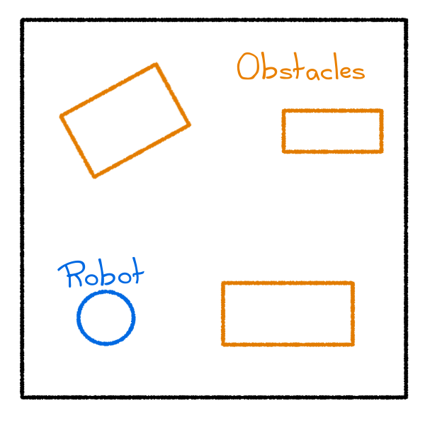
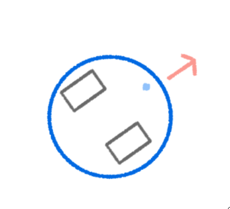
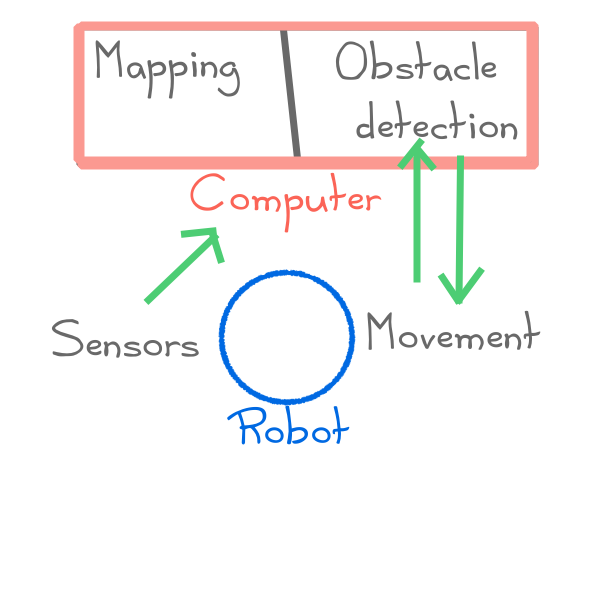

# Task description

This task is to create a map of a simple environment using a mobile robot and computer vision techniques.

# Environment description

The environment that the robot must map consists of a 3x3 meter space with box-like obstacles.

# Robot description

## Robot

The proposed robot is a Roomba Create, that will be assisted by a computer vision system.

![Roomba Create, image retrieved from [@ackerman-2021]](https://assets.rbl.ms/25583866/origin.jpg)

## Sensors

The robot will have a camera that will be used to detect the obstacles in the environment and the creation of the map of the environment.

Alternatively, the robot could use some other kind of sensors to detect the obstacles in the environment, like infrared sensors and bumpers integrated in the robot.

## Actuators

The robot won't need to grasp any objects, the only interaction with the environment will navigation trough the environment.

## Movement

The Roomba robot possesses a motor and a pair of wheels, that let it move trough the environment. 

## Behaviors

So far we have identified the following behaviors:

* Wander: The robot will move randomly in the environment.
* Avoid Obstacles: The robot will avoid obstacles in the environment to prevent it from crashing.
* Explore: The robot will try to determine wich area of the environment is yet to be explored and then move to it.

## Architecture

# Possible problems

Some of the problems that could be run into while developing this project are:

* Is not possible to integrate correctly the ROS system with the robot.
* It is not possible to integrate the robot with the computer vision system.
* The robot computer vision system or alternative the infrared sensors, can't provide enough information to the robot to create the map of the environment.

# References
